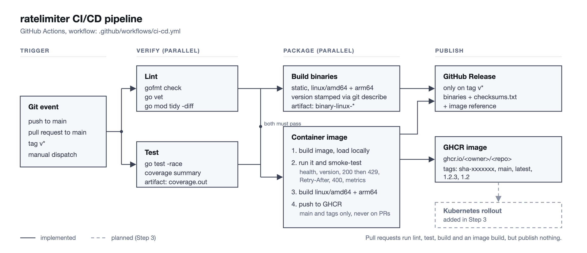

# ratelimiter

[](https://github.com/YHQZ1/local-rate-limiter-service/actions/workflows/ci-cd.yml)

A small HTTP service that answers one question: **"may this caller do this right now?"**

Other services call `POST /check` with a key (a user ID, API key, IP address, ...). The service keeps a [token bucket](https://en.wikipedia.org/wiki/Token_bucket) per key and replies allow or deny. Written in Go with the standard library plus the Prometheus client.

## How it works

Every key has a bucket that holds up to `BURST` tokens and refills continuously at `RATE_PER_SEC` tokens per second. A check spends tokens (1 by default). If the bucket can't cover the cost the request is denied with `429` and a `Retry-After` telling the caller how long to wait.

- Buckets are created on first use, full.
- A bucket that has been idle long enough to refill completely is identical to a new one, so the janitor deletes it without losing any information. This keeps memory bounded.
- `MAX_KEYS` caps tracked keys. At the cap, idle keys are evicted first; if none can be, new keys get `503` while existing keys keep working.

## Run

```bash
make run                           # go run, listens on :8080
make build && ./bin/ratelimiter    # static binary in bin/
RATE_PER_SEC=1 BURST=3 make run    # strict limits, handy for demos
```

Then open **http://localhost:8080** for the built-in UI (see below).

Or try it from the terminal (burst of 3, then denied):

```bash
for i in 1 2 3 4; do
  curl -s -i -X POST localhost:8080/check -d '{"key":"user42"}' | grep -E '^HTTP|allowed'
done
```

## API

### `POST /check`

```json
{ "key": "user42", "cost": 1 }
```

`key` is required (1 to 256 bytes). `cost` is optional (default 1, at most `BURST`).

| Status | Meaning |
| ------ | ------- |
| `200` | Allowed. |
| `429` | Denied. `Retry-After` header gives whole seconds to wait. |
| `400` | Bad JSON, missing/oversized key, or invalid cost. |
| `413` | Body larger than 1 KiB. |
| `503` | Too many tracked keys; retry shortly. |

Body (200 and 429):

```json
{ "allowed": true, "remaining": 9, "limit": 10, "retry_after_seconds": 0 }
```

Headers: `X-RateLimit-Limit`, `X-RateLimit-Remaining`, and `Retry-After` on 429.

### Operational endpoints

| Path | Description |
| ---- | ----------- |
| `GET /` | Built-in web UI |
| `GET /health` | `{"status":"ok"}`, for liveness/readiness probes |
| `GET /config` | `{"rate_per_sec":5,"burst":10}`, the limits in force |
| `GET /version` | `{"version":"..."}` |
| `GET /metrics` | Prometheus metrics |

## Web UI

`GET /` serves a single self-contained page (embedded in the binary: no extra container, no CDN, no CORS). It has two halves:

- **Playground**: send one request, fire a burst, or auto-send at N requests/sec for any key. A gauge shows the key's bucket draining and refilling, and a log lists the last responses.
- **Live service view**: reads `/metrics` once a second and shows allowed/denied per second, a 60 s throughput chart, p95 latency of `/check`, active keys, total checks and the 5xx count. It covers *all* clients, so run a load script and watch it react. The version badge at the top makes a rolling update visible.

It is a demo and debugging aid, not a replacement for a real Prometheus + Grafana setup. The page is flat, dark and uses the [Inter](https://rsms.me/inter/) typeface, embedded in the binary (SIL Open Font License, text in `internal/server/web/OFL-Inter.txt`).

## Configuration

All via environment variables.

| Variable | Default | Meaning |
| -------- | ------- | ------- |
| `PORT` | `8080` | Listen port |
| `RATE_PER_SEC` | `5` | Tokens refilled per second, per key |
| `BURST` | `10` | Bucket size, per key |
| `MAX_KEYS` | `100000` | Distinct keys tracked at once |
| `CLEANUP_INTERVAL` | `30s` | How often idle keys are swept |
| `SHUTDOWN_TIMEOUT` | `10s` | Max time to finish in-flight requests on SIGTERM |
| `LOG_LEVEL` | `info` | `debug`, `info`, `warn`, `error` |
| `APP_VERSION` | build-time value (`dev`) | Reported by `/version` and `/metrics` |

Invalid values stop startup with a message naming every bad variable.

## Observability

Logs are JSON on stdout, one line per request (`/health` and `/metrics` are logged at `debug` to keep probe noise out).

| Metric | Type | Notes |
| ------ | ---- | ----- |
| `ratelimiter_checks_total{result}` | counter | `allowed`, `denied`, `error` |
| `ratelimiter_http_requests_total{method,path,code}` | counter | Error rate = `code=~"5.."` over total |
| `ratelimiter_http_request_duration_seconds{path}` | histogram | Latency by route |
| `ratelimiter_active_keys` | gauge | Keys currently tracked |
| `ratelimiter_evicted_keys_total` | counter | Idle keys dropped |
| `ratelimiter_build_info{version}` | gauge | Always 1 |
| `go_*`, `process_*` | | Runtime and process stats (uptime via `process_start_time_seconds`) |

Note that a `429` is the limiter working as intended, not a server error: it counts toward `denied`, not toward the 5xx error rate.

## Develop

```bash
make test    # unit + HTTP tests
make race    # same, with the race detector
make bench   # limiter micro-benchmark
make vet fmt
```

## CI/CD

GitHub Actions, defined in [`.github/workflows/ci-cd.yml`](.github/workflows/ci-cd.yml).



(Vector version: [`docs/pipeline.svg`](docs/pipeline.svg).)

| Stage | Runs on | What it does |
| ----- | ------- | ------------ |
| Lint | every event | `gofmt` check, `go vet`, `go mod tidy -diff` |
| Test | every event | `go test -race` with coverage (summary on the run page, `coverage.out` as an artifact) |
| Build | after Lint + Test | Static `linux/amd64` and `linux/arm64` binaries with the version stamped in; uploaded as artifacts |
| Container image | after Lint + Test | Builds the image, runs it and smoke-tests it with `scripts/smoke.sh`, then builds both architectures. Pushes to GHCR on `main` and tags only, never on pull requests |
| GitHub release | tags `v*` only | Creates a release with the binaries, `checksums.txt` and the image reference |

Image tags on `ghcr.io/yhqz1/local-rate-limiter-service`: `sha-<short>` for every push, `main` and `latest` for the default branch, and `1.2.3` / `1.2` for release tags. The version baked into the binary (`/version`) comes from `git describe`, so a tagged build reports its tag.

**Cut a release**

```bash
git tag v1.0.0 && git push origin v1.0.0
```

**Run the same checks locally**

```bash
make vet race                       # lint + tests
docker build -t ratelimiter:dev .   # image
docker run -d -p 8080:8080 -e RATE_PER_SEC=1 -e BURST=3 ratelimiter:dev
scripts/smoke.sh http://localhost:8080
```

Pushing to the registry uses the workflow's built-in `GITHUB_TOKEN`; no secrets need to be configured. A newly published GHCR package starts private. To pull it without logging in (for example from a local Kubernetes cluster), make it public under the package's settings on GitHub.

## Design notes and limits

- **State is per instance, in memory.** Run several replicas and each keeps its own buckets, so a key's effective limit is roughly `replicas x` the configured one unless requests for a key are routed to the same instance. Sharing state would need something like Redis; that is deliberately out of scope.
- State is lost on restart; every key starts with a full bucket.
- One mutex guards the bucket map. That is plenty for this workload (see `make bench`); sharding the map would be the next step under extreme contention.
- Time uses Go's monotonic clock, so wall-clock jumps don't grant or steal tokens.
