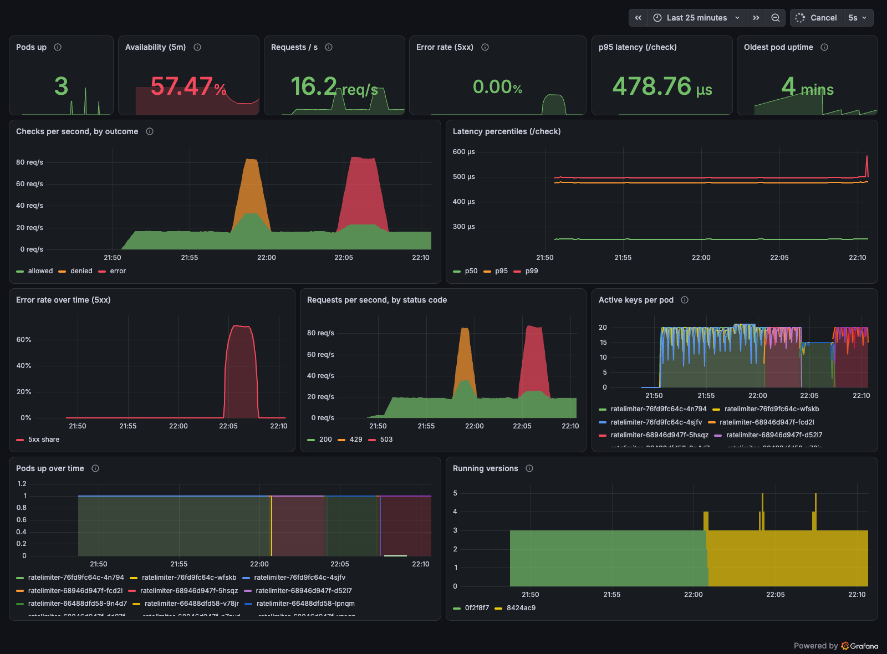
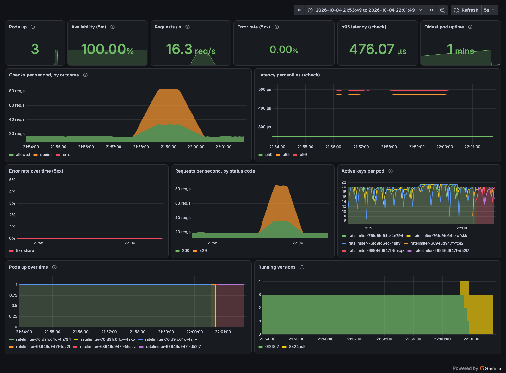
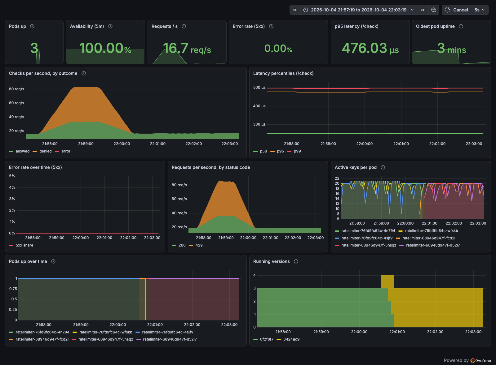
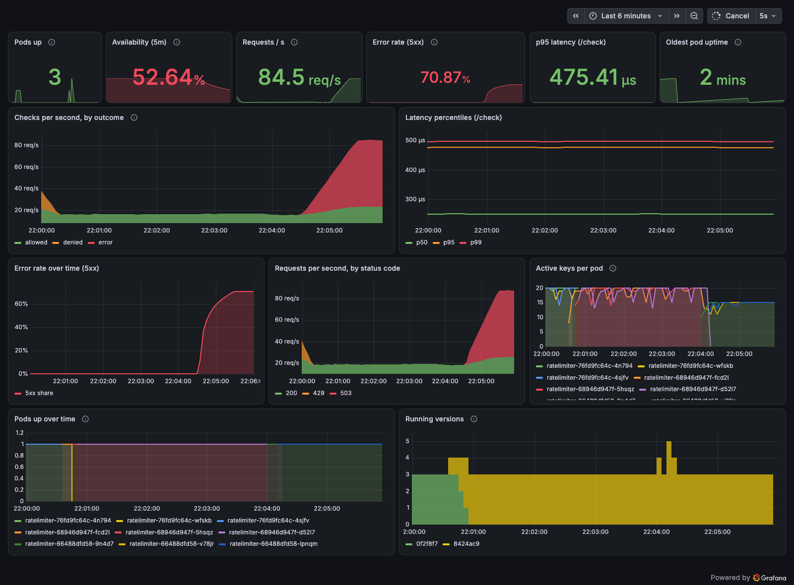
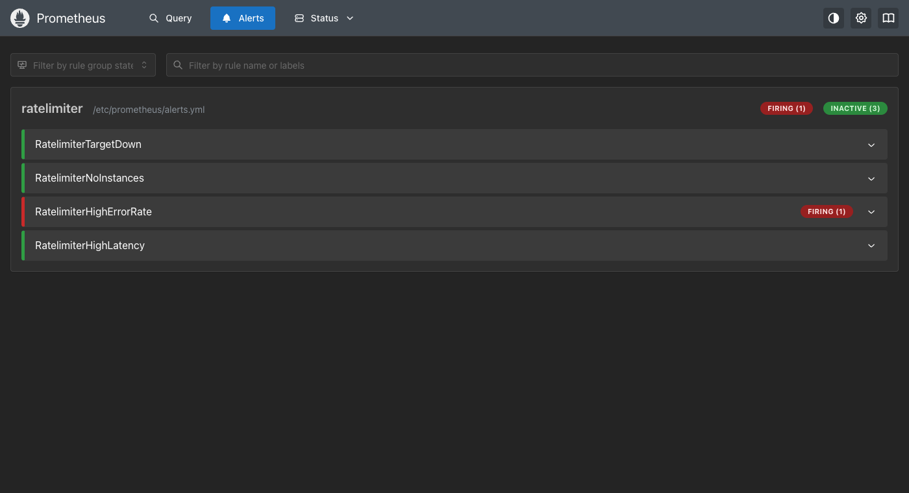
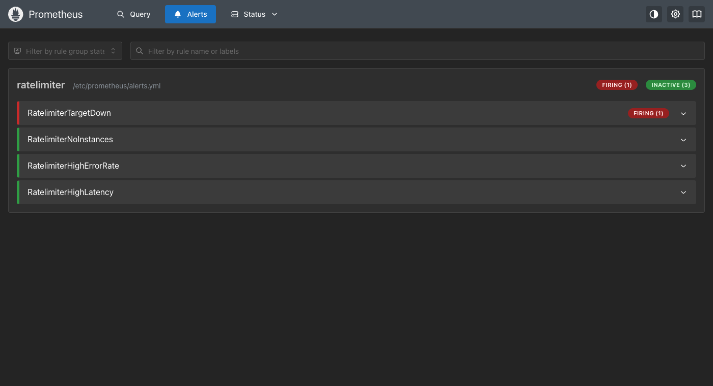

# Monitoring: Prometheus and Grafana

Prometheus scrapes the ratelimiter pods' `/metrics` endpoint; Grafana draws a dashboard from it. Both run in the cluster as plain manifests (no Helm, no operator), in their own `monitoring` namespace.



## What is in here

| Path | What it is |
| ---- | ---------- |
| `kustomization.yaml` | Applies everything: `kubectl apply -k monitoring/` |
| `prometheus/prometheus.yml` | Scrape config: finds the ratelimiter pods through the Kubernetes API, scrapes every 5 s |
| `prometheus/alerts.yml` | Four alert rules |
| `prometheus/rbac.yaml` | Lets Prometheus list pods in the `ratelimiter` namespace, and nothing else |
| `prometheus/deployment.yaml` | Prometheus Deployment and Service |
| `grafana/deployment.yaml` | Grafana Deployment and Service |
| `grafana/datasources.yaml` | Provisions the Prometheus datasource |
| `grafana/dashboard-provider.yaml` | Tells Grafana to load dashboards from a folder |
| `grafana/dashboards/ratelimiter.json` | The dashboard (generated by `grafana/gen_dashboard.py`) |
| `demo/traffic.sh` | Generates normal, abusive and error traffic from inside the cluster |

The datasource and dashboard are provisioned from files, so a fresh Grafana comes up already configured. Editing the dashboard in the UI is disabled on purpose: the JSON in git is the source of truth. To change it, edit `gen_dashboard.py`, run it from the repo root, and re-apply.

## Install

Needs the cluster from [`k8s/`](../k8s/README.md) to be running.

```bash
# 1. Grafana's admin password lives in a Secret that is never committed
kubectl create namespace monitoring
kubectl -n monitoring create secret generic grafana-admin --from-literal=password='<choose one>'

# 2. Everything else
kubectl apply -k monitoring/
kubectl -n monitoring rollout status deployment/prometheus deployment/grafana

# 3. Open them (each in its own terminal)
kubectl -n monitoring port-forward svc/grafana 3000:3000        # http://localhost:3000, user "admin"
kubectl -n monitoring port-forward svc/prometheus 9090:9090     # http://localhost:9090
```

Grafana opens on the ratelimiter dashboard. To read the password back later:
`kubectl -n monitoring get secret grafana-admin -o jsonpath='{.data.password}' | base64 -d`.

## What the service exposes

`GET /metrics` on each pod, in the Prometheus text format:

| Metric | Type | Meaning |
| ------ | ---- | ------- |
| `ratelimiter_checks_total{result}` | counter | Decisions: `allowed`, `denied` (429), `error` (503) |
| `ratelimiter_http_requests_total{method,path,code}` | counter | Every HTTP request |
| `ratelimiter_http_request_duration_seconds{path}` | histogram | Latency |
| `ratelimiter_active_keys` | gauge | Keys currently tracked |
| `ratelimiter_build_info{version}` | gauge | Always 1; the label says which release is running |
| `up`, `process_start_time_seconds`, `go_*` | | Added by Prometheus and the Go runtime |

## The dashboard

The three things the assignment asks for, and where to find them:

| Ask | Panels | Query |
| --- | ------ | ----- |
| **Uptime** | Pods up, Oldest pod uptime, Pods up over time | `sum(up{job="ratelimiter"})`, `max(time() - process_start_time_seconds)` |
| **Availability** | Availability (5m) | share of requests that did not fail with a 5xx over 5 minutes |
| **Latency** | p95 latency, Latency percentiles (p50/p95/p99) | `histogram_quantile(0.95, sum by (le) (rate(..._bucket{path="/check"}[1m])))` |
| **Error rate** | Error rate (5xx), Error rate over time | `sum(rate(requests{code=~"5.."}[1m])) / sum(rate(requests[1m]))` |

Also on the dashboard: requests per second by outcome and by status code, active keys per pod, and **Running versions**, which counts pods per release and so shows a rolling update happening.

Two details that are easy to get wrong:

- **A 429 is not an error.** Denied requests are the limiter working, so they are shown in orange and kept out of the error rate. Only 5xx counts as a failure.
- **Availability is a request-based measure over 5 minutes.** An earlier version measured scrape success instead, and dipped to 99.66% during a rollout that dropped no requests, because a pod that is shutting down briefly stops answering scrapes. The "Pods up over time" panel still shows that blip honestly. Because of the 5-minute window, Availability takes about five minutes to recover after errors stop, while the error rate (1-minute window) recovers almost at once.

## Alerts

| Alert | Fires when |
| ----- | ---------- |
| `RatelimiterTargetDown` | a pod fails its scrape for 30 s (crash-looping pods count) |
| `RatelimiterNoInstances` | Prometheus sees no ratelimiter pods at all, for 30 s |
| `RatelimiterHighErrorRate` | more than 5% of requests are 5xx, for 30 s |
| `RatelimiterHighLatency` | p95 of `/check` is above 100 ms, for 1 minute |

They are visible at http://localhost:9090/alerts. There is no Alertmanager, so nothing is sent anywhere: this is a demo of the rules, not of paging.

## Try it: generate traffic and break things

Run these while watching the dashboard (set the time range to the last 5 to 15 minutes and refresh to 5 s).

```bash
monitoring/demo/traffic.sh normal 600     # ~20 req/s over 20 keys: everything allowed
monitoring/demo/traffic.sh abuse  120     # one key at ~100 req/s: mostly 429
monitoring/demo/traffic.sh stop           # remove the traffic pods
```

**1. Rate limiting.** Run `normal`, then `abuse`. The orange band is denied requests; the error rate stays at 0%.



**2. Rolling update.** Change the image while `normal` runs. Running versions swaps one release for the other, with a brief overlap of four pods while the new one starts, and availability stays at 100%.

```bash
kubectl -n ratelimiter set image deployment/ratelimiter ratelimiter=ghcr.io/yhqz1/local-rate-limiter-service:sha-0f2f8f7
```



**3. Real server errors.** The service only returns a 5xx when its key table overflows, so shrink the table and flood it with new keys. Error rate jumps, availability falls, and `RatelimiterHighErrorRate` fires.

```bash
kubectl -n ratelimiter set env deployment/ratelimiter MAX_KEYS=15
monitoring/demo/traffic.sh unique 150
# afterwards:
kubectl -n ratelimiter rollout undo deployment/ratelimiter
```




**4. A crash-looping pod.** An invalid setting makes new pods crash. `RatelimiterTargetDown` fires and names the pod, while the healthy pods keep serving.

```bash
kubectl -n ratelimiter set env deployment/ratelimiter BURST=0
# afterwards:
kubectl -n ratelimiter rollout undo deployment/ratelimiter
```



## Things worth knowing

- **Scrape interval is 5 s** so the dashboard reacts quickly. A real system would use 15 s or more.
- **Storage is ephemeral.** Prometheus and Grafana use `emptyDir`, so metrics and any state are lost when their pods restart. The dashboard is rebuilt from the ConfigMap each time. A persistent setup would add PersistentVolumeClaims.
- **Grafana needs more memory than you would guess.** With a 384 Mi limit the container was OOM-killed shortly after start-up (probably because Grafana 13 preloads several bundled app plugins), which showed up as every panel reading "No data". The manifest now allows 768 Mi and the pod has been stable since.
- **Pods that are not Ready are still scraped**, as long as they are Running. That is deliberate: a crash-looping pod should appear as `up == 0` rather than silently vanish.
- **Metrics are per pod.** `ratelimiter_active_keys` and the buckets behind it are not shared between replicas (see the caveat in the [Kubernetes notes](../k8s/README.md)).

## Clean up

```bash
kubectl delete -k monitoring/
kubectl delete namespace monitoring
```
